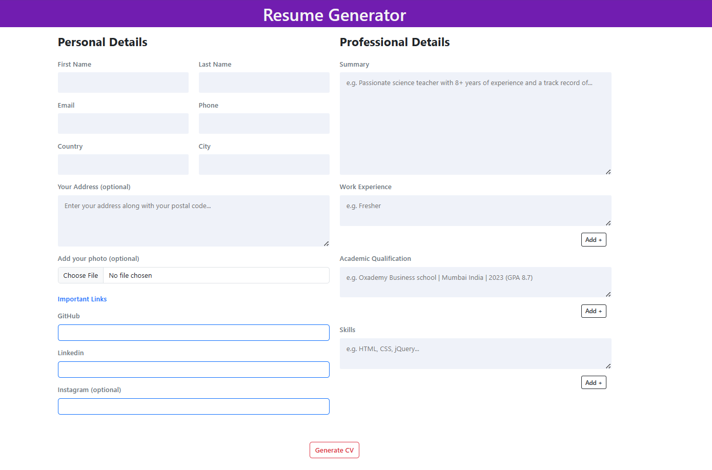

# Resume Builder

The Resume Builder is a web application that allows users to easily create and customize their CVs (Curriculum Vitae) by providing essential details such as personal information, work experience, education, and more. The generated CV can be printed directly from the browser.



## Features

- **User-friendly Interface:** Intuitive and easy-to-use interface for a seamless user experience.
- **Customization:** Ability to add and edit various sections of the resume, including personal details, work experience, education, skills, and more.
- **Profile Photo:** Users can upload a profile photo to include in their CV.
- **Print Functionality:** Generate a print-friendly version of the CV for easy printing directly from the browser.

## Demo

LIVE DEMO : https://resumegenrator-anshuman.netlify.app/

## Getting Started

These instructions will help you set up the project on your local machine for development and testing purposes.

### Prerequisites

- Web browser (Google Chrome, Mozilla Firefox, etc.)
- Code editor (Visual Studio Code, Sublime Text, etc.)

### Installation

1. Clone the repository:

   ```bash
   git clone https://github.com/theanshumansinha/resume-builder.git
   ```

2. Open the project folder in your code editor.

3. Open `index.html` in your web browser.

## Usage

1. Open `index.html` in a web browser.
2. Fill in the required details in each section.
3. Click on the "Print" button to generate and print the CV.

## Contributing

If you'd like to contribute to this project, please follow the steps below:

1. Fork the repository.
2. Create a new branch for your feature: `git checkout -b feature-name`.
3. Commit your changes: `git commit -m 'Add new feature'`.
4. Push to the branch: `git push origin feature-name`.
5. Submit a pull request.

## License

This project is licensed under the [@theanshumansinha](LICENSE.md) - see the [LICENSE.md](LICENSE.md) file for details.

## Acknowledgments

-  I used Bootstrap it really helps me to doing code.

```
